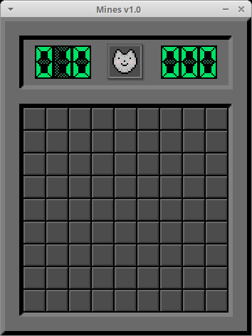
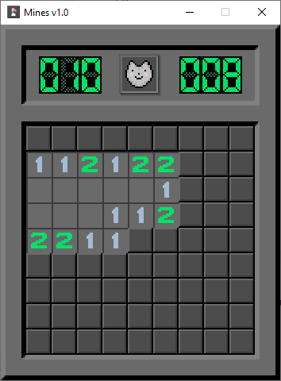

# Mines

Mines is a classic puzzle game where you have to open cells on a field, avoiding mines. The goal of the game is to find all the mines on the field and mark them with flags.

## Technologies
This project is written in C and uses the following libraries:
- [GLFW](https://www.glfw.org/) - for creating a window and handling input
- [stb](https://github.com/nothings/stb) - for loading images
- [glad](https://glad.dav1d.de/) - for loading OpenGL functions
- [Discord GameSDK](https://discord.com/developers/docs/game-sdk/sdk-starter-guide) - for supporting Discord Rich Presence (optional)

## Building
To build the project, you need to have a C compiler and CMake installed. You also need to clone the repository with submodules:
```sh
git clone --recursive https://github.com/adasdead/mines
```
If you want to enable Discord Rich Presence support, you need to download Discord Game SDK and unpack it into the `deps/discord_sdk` folder. This can be done in two ways:
1. Run the script `discord_sdk.py` in the `deps` folder:
```sh
python discord_sdk.py
```
2. Download the archive from https://dl-game-sdk.discordapp.net/2.5.6/discord_game_sdk.zip and unpack it into the `deps/discord_sdk` folder.

> __Warning__: Currently, Discord Rich Presence is only supported on Windows and x86_64 architecture.

After that, you can build the project using CMake:
```sh
cmake . -Bbuild -DCMAKE_BUILD_TYPE=Release
cmake --build ./build
./bin/mines # run game
```

## Controls
The game is controlled with the keyboard and mouse. Here are the main keys:

- `D` - change difficulty
- `N` - reset current game
- `ESC` - close game

To open a cell on the field, you need to click on it with the `left mouse button`. <br>
To mark a mine, you need to click on it with the `right mouse button`.

## Screenshots
|                 xubuntu                 |                 windows                 |
|:---------------------------------------:|:---------------------------------------:|
|  |  |

## License
The project is distributed under the MIT license. See [LICENSE](LICENSE) file for details.

